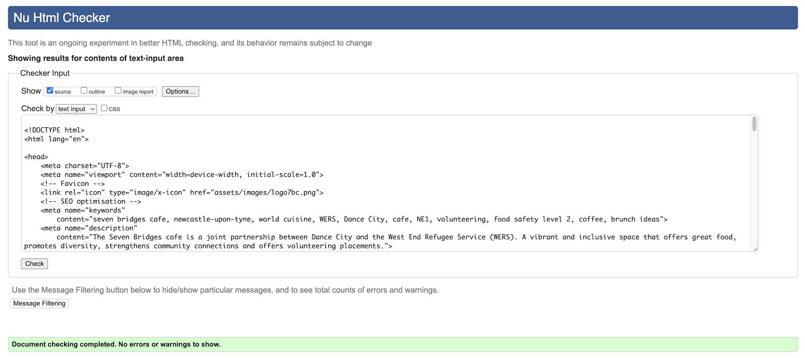

# The Seven Bridges
[View deployed site here](https://osoriomica.github.io/7BC/)

This is an exercise to reimagine the website for The Seven Bridges inside Dance City, Newcastle. I volunteered in their kitchen when the project was just taking shape and helped to cook free meals for people in need. The organisation's director has given me permission to use this as a case study. 

Parting from the existing website and social media presence, my version of The Seven Bridges website aims to convey a different personality of the cafe and its ethos and offer a customer friendly interface and engaging copy.

The original website can be visited here: [The Seven Bridges](https://thesevenbridges.co.uk/#)

## Strategy
In this first deployment, I focus on a basic structure for the site with 3 pages that provide an overview of the cafe and the work placement project, showcase their current menu and colourful design, and finally, provide a contact page for potential volunteers and donors to reach the business.
The business goals for this website are:
-Build brand awareness and trust.
-Provide an online presence that better reflects their ethos.
-Translate users into followers, in-person customers, volunteers or donors.
-Appealing imagery to reflect their seasonal menus and friendliness of their staff.

The customer goals of this website are:
-Being able to plan a visit to The Seven Bridges.
-Learn about the volunteer project taking place at the restaurant.
-Being able to contact the organisation with enquiries and feedback.
-Connect with the organisation through their social media. 

**Note from the developer:** During the drafting and strategy process, I visited The Seven Bridges to take new photos, consulted their printed materials with the original website and talked with the front of house staff and headchef about their online presence.
I found The Seven Bridges was not listed on Google Maps, so I've now created a listing for them with some of the photos and correct contact details and a review in order to help their online visibility. I've included this listing as a feature on the homepage under "Where to find us" section.   
I also consulted the copy available at [The West End Refugee Service (WERS) website](https://www.wers.org.uk/7bc) regarding The Seven Bridges and compared it to the original website. I've used a mashup from both sources and edited the copy to suit my project. 

### User stories

This website is used by the following users:

**Parents of students at Dance City**

There's a vibrant educational offer throughout the week and many of the students are young people who are accompanied by their parents.
  On Sunday mornings, there's a Spanish language club with multiple groups or different ages and levels who come to class. Parents are welcomed to wait for the children inside The Seven Bridges cafe and some families stay for lunch after classes are finished.
- Their use of the website: finding about the menu, seasonal dishes, events, opening times, car park suggestions, how to find the cafe.
  
**Potential Volunteers**
  
The cafe is trying to recruit volunteers from the West End Refugee Service to sign up for a 6-week placement where they get to learn industry skills, gain experience and propose new dishes for the menu. 

- Their use of the website: Find more information about the project and the place itself. Look at appealing photos that reflect the diverse gastronomical influences of the menu. Getting in touch through a contact form. Access social media channels to get inspiration and decide to join the projet. Finding links to the parent oroganisations Dance City and the West End Refugee Service (WERS).
  
## Scope - Features

Based on the previous information, this website includes the following features:

**Homepage:**
- Responsive navbar with logo  
- Hero image with photo of a vibrant-looking dish and a heading  
- Introductory text that invites customers to visit and try the food  
- Photos of the menu dishes in a 3 by 2 responsive table  
- Opening Hours with accompanying image of a sitting area within the cafe    
- Find us section: a Google Maps iframe followed by address/telephone number  
- Footer with relevant external links to Dance City, WERS, social media and Deliveroo  

**About us**
- Responsive navbar with logo  
- Larger text that better explains the essence of the project and what the volunteers get from it (separated into 2 columns that grow with the screen)    
- Photo of the people involved to generate a sense of family/friends and trust towards the project    
- Call to action to get in touch (link to Contact page)  
- Footer with relevant external links to Dance City, WERS, social media and Deliveroo  

**Contact**
- Responsive navbar with logo  
- Hero/background image with friendly staff portrayed   
- Call to action Heading and paragraph inviting to fill the form  
- Form requesting first name, last name, email address (needed to be validated before submission), a submit button and a redirect to a thank you page on submission  
- Footer with relevant external links to Dance City, WERS, social media and Deliveroo  

## Structure
The website follows a simple linear structure to not overload the users. Both the header and the footer are present across all pages.
1. Homepage:
    - Header with navbar to Home, About us and Contact (navbar elements to change background colours and weight on hover and only weight when active). Logo to the right with link to Home.  
    - Hero image firectly under the header. Heading "FOOD. CONVERSTION. ART." over the image.
    - Intro text with accompanying image of a plant on a table of the cafe.
    - Small gallery with photos of menu dishes.
    - Opening Times section.
    - Where to Find us section with Google Maps embedded iframe and text address and telephone number underneath.
    - Footer with logos to Dance City and WERS, social media icons (instagram and facebook) and deliveroo icon  
2. About us:
    - Header with navbar to Home, About us and Contact. Logo to the right with link to Home.  
    - Block of text with project description and story.  
    - Block of text to the right with a list of skills offered to volunteers.  
    - Button with call to action to get in touch (link to Contact page).  
    - Footer with logos to Dance City and WERS, social media icons (instagram and facebook) and deliveroo icon  
3. Contact:
    - header with navbar to Home, About us and Contact. Logo to the right with link to Home
    - background image of staff having a good time.
    - form with heading "VOLUNTEER. DONATE. GET IN TOUCH" and small paragraph inviting to fill in the form. Form requests First name, Last name, email and offers a text box to write a message. Submit button with a redirect to a Thank you page. 
    - footer with logos to Dance City and WERS, social media icons (instagram and facebook) and deliveroo icon  
    - **A thank you page**. With a confirmation message for the user and a button to go "BACK TO HOME".     

## Skeleton
The information architecture and inner wireframes can be consulted in the [Readme Folder](https://github.com/osoriomica/7BC) available on my 7BC repo on Github.

**Here you may also see the skeleton sketches for each page (click on the arrows to see the relevant skeleton sketches):**

<strong>Homepage</strong> 

   

<strong>About us</strong> 

  

<strong>Contact </strong> 

   

<strong>Thank you</strong>

   

### Information Architecture diagram

## Surface

### Color Reference
The colour palette used throught the website is the same as the official branding used by Dance City in regards of the project. The features in this website have bold colours in the background, interactive elements and sections with block colours to reflect the style of the actual premises (bright blue walls, red chairs, plants hanging from the ceiling, etc.)
These are the four main colours:

| Color             | Hex                                                                |
| ----------------- | ------------------------------------------------------------------ |
|  | #bd1a21
| | #048382 |
|  |#f7981c|
|  | #f15820 |

**This website uses the colours provided by the original branding guideline.**  
The finished Website should have: 
1. Header:
 - Positioned at the top, it spans across the whole width of the screen. Height is set by the Seven Bridges square Logo located in the top right corner. The navbar is positioned in the top left of the header.
 - A box shadow line runs under the header to separate it visually from the rest of the content.
 - It all scrolls out of view when user moves down the page.
 - Navbar links on hover change format to Yellow background #f7981c and white font colour.
 - Active links are formatted with a heavier font weight to make them stand out.  
2. Footer:
- Sticky footer sitting at the bottom of the page, hides "under" Main content.  
- Centred contents Logos on top of icons or side by side on larger screens.  
- Logos and icons on white. Background in orange #f15820.  
3. Background image: Fixed at the very back of the layout. Each page has the same background image.  
3. Hero images / heading:
- Spans across screen. No side margins.  
- Heading over the image to the left and centered vertically. Background in blue #048382 with light transparency.
- Heading in bold letters. Colour White. Font size of double the normal text. 
4. Text blocks:
- Every text block has a background in blue #048382 with light transparency.  
- Inner padding around the text and a margin to make it float over the background image. Text colour in white for contrast.  
- Slight rounding of corners  
5. Individual images:  
- Sized the same as the text blocks if displayed on the same row.  
- Standalone images (group photo) to span across screen for bigger impact.  
- Slight rounding of corners on images.  
6. Gallery:  
- Rectangular table with photos on a 3 by 2 display. 
- Width spans across the screen.  
- Grows with screen to a maximum of 1800px. 
7. Form:  
- Set over the hero image on Contact page. Blue #048382 background. White font colour. Heading styled on uppercase. Bold.  
- Text input fields on a separate line to the input name (i.e. First Name:), as wide as containing box and padding allow. Border of fields in a solid white line and transparent background (blue). When active, background turns white and input text is dark grey to make it easier to read.  
- Slight rounding of corners on all boxes.  
8. Thank you page:  
- H2: THANK YOU!  
- paragraph under: Thank you for contacting us, we'll get in touch to you soon!  
9. Size restrictions and responsiveness:  
-  Website is mobile first.  
- Media queries and use of flexbox to increase sizing of elements and rearranging them on the grid.  
- Maximum size is set to 1800px. Screens bigger than that see the main elements of the body staying the same size in the center of the screen through the use of max-width:1800px and margins left and right set to auto. This is to prevent the site from over stretching on extra large screens.  
10. Buttons:
- Round Edges.  
- Red #bd1a21 background.  
- On hover, background turns yellow #f7981c  
- Padding around text.
11. Fonts:
- Headings: 'Roboto', reduced letter spacing.
- Normal text: 'Questrial'
- The general fallback is sans-serif and web-safe fonts.
- Font color is off white (#fafafa) except for navbar links in dark gray (over a white background). 
  
      
## Acknowledgements

Thanks to my mentor Brian Macharia for his time and amazing way of explaining absolutely anything perfectly.  
To the folk at Dance City and The Seven Bridges for allowing me to reimagine their website.  

### Credits and external code sources
Copy and most of the photos and imagery used were taken from the original website, prited menus and social media accounts. They were slightly modified to better suit this project.  
The base of the website follows closely the layout and code used on the Walkthrough project Love Running by Code Institute. 
Snippets of code taken from these sources were then edited to fit the needs of this project.  
Some references were introduced within the code as comments over the relevant sections.  
**Websites used in the development of this website:**  
- https://www.w3schools.com/ on CSS: Navbar, Pseudo-classes, z-index, Website Layout and columns; Hide menu on scroll, pseudo-classes, etc.  
- https://developer.mozilla.org/en-US/ on: Box-Shadow and aria labels.  
- https://fontawesome.com/ for the icons: Facebook, Instagram, location pin and telephone.  
- https://www.svgrepo.com/ for the icon: Deliveroo. 
- https://www.codecademy.com/resources/docs/html/semantic-html/address on: semantic tag < address >. 

## Technologies used
This website was mainly written with HTML and CSS. I've used a couple of JS scripts from external sources. 
- [google fonts](https://fonts.google.com/)  
- https://imagecolorpicker.com/ to find the rgb values of my colour palette.
- [Grammarly](https://app.grammarly.com/) to spell check my copy.
- Github Codespaces for the entire development of the website.

## Deployment
For a future deployment, it would be best practice to optimise all imagery used to increase loading times. I would also like to digitalise the printed menus and have them as downloadable files on the homepage. I would like to add a donations section and a relevant link on the About us page. 

For deploying the website, I followed the steps given by Codeinsitute’s tutorials:  
1. Go to the Settings tab of your GitHub repo.  
2. On the left-hand sidebar, in the Code and automation section, select Pages.  
3. Make sure:  
    * Source is set to 'Deploy from Branch'. 
    * Main branch is selected. 
    * Folder is set to / (root).  
4. Under Branch, click Save. 
5. Go back to the Code tab. Wait for the build to finish and refresh your repo. 
6. In the Environments section, click on 'github-pages'. 
7. Click View deployment to see the live site.  

**To clone and deploy this project**
From your account of Github, visit my repository [7BC](https://github.com/<osoriomica>/<7BC>) 
Locate the Project GitHub repository and click the green "Gitpod" icon on the top right corner of my repo to start a new Gitpod workspace. 
You then have the option of working locally or downloading the project locally to be edited with an IDE such as VS code. 

## Validation
The site has been continously checked for validation since deployment. It has passed the validation checks both on **W3C Nu HTML Validation Checker** and **W3C CSS Validation Service**.

**W3C CSS Validation:**

    

<strong>W3C NU HTML Validation:</strong> (click on the arrow to see the html validation screenshots)

 

 
 
 
 

### Testing and debugging

Along the building of the website, the code was constantly tested to make sure the elements looked as intended.  

Some of the testing included:  
    - Running the terminal preview to see the code on a Google Chrome browser. If an element was out of place or not behaving properly, I would then go back to the code to check the structure and the values used.  
    - Using Inspect, Dev Tools to identify strange margins and sizing of elements and their relation to the rest of the page.  
    - Checking all buttons and links were properly working by clicking on them. When this failed, I would then go back to the code to make sure that the paths used were correct or that the closing tags where there or that there were no mispellings on the code. 
    - Resizing the screen using different the devices available on the dropdown menu of the Inspect Tool of Google Chrome.  
        This was particularly useful to see how my website would look from the smallest screens and how it changed as the screen went past the different media queries' thresholds. Sometimes, an element would jump in size or leave odd gaps on the layout and being able to see them on the preview would allow me to go back to the code and change values or add new rules to particular items. 
    - Test1: Checking website works on extra large screens. Issue: The layout would stretch out and be umpleasant to look at. Fix: Set a max width for the body and clear both sides with automatic left and right margins (fix offered by mentor).  
    - Test2: Contact form redirecting to a Thank you page. Issue: Github doesn't allow POST method and won't let me redirect to the Thank you page. Fix: Change method to GET (for the sake of the project submission). 
    - Test3: Checking Footer doesn't impede the readibility of my website (specially on mobile). Issue: Originally the footer was always visible and would take up too much space of the screen making for a limited area for the main content. FIx: change position to sticky and give main content a higher z-index to make it overlap the footer and slide it under. 
    - Test4: Navbar's position on the screen. Issue: On mobile screens, Navbar was taking too much space from the main content. Fix: Included a Javascript function to make it scroll up out of the screen when the user scrolls down.     
    - Test5: Lighthouse Test. Issue: Some of the images used where slowing down the website and scored poorly on speed. Fix: Edited the size of the image files to fit the maximum size they'd be displayed on the website, then I changed their format to png and replaced them on the repository.

## Related

Here are some websites related to this project: 
- [West End Refugee Service - WERS](https://www.wers.org.uk/)
- [Dance City](https://www.dancecity.co.uk/) 